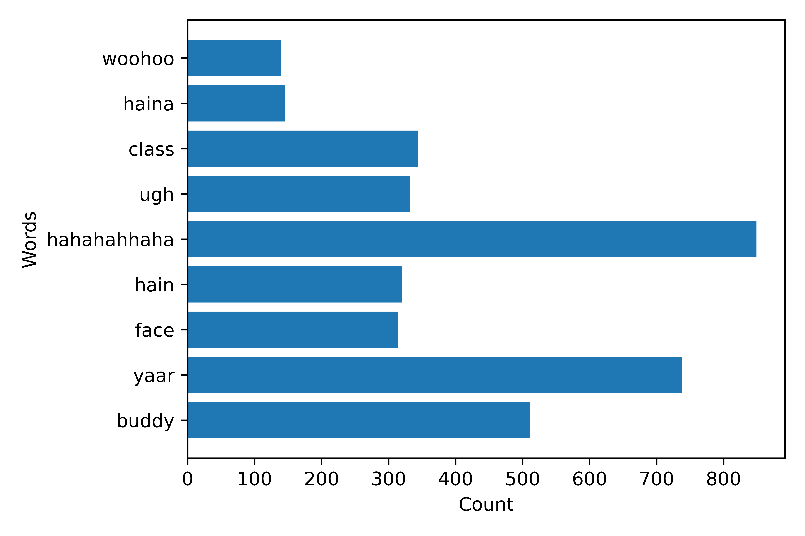

# Analyzing WhatsApp Chats with Pandas

*Akalank Jayakumar*

In this post, I go over a project of mine where I extracted information from a WhatsApp chat export (a `.txt` file). The chat contains 40,000 messages from July 15th to October 2nd, 2020. 

### Sections

- Loading the required modules and the data
- Data Extraction
- Data Cleaning
- **Plots**
    - Number of messages sent by each individual in the group
    - Number of messages sent by date
    - Number of messages sent by hour of the day
    - Frequently used words

---

## Loading the required modules and the data

First, let's load the required libraries. We'll need:

1. **Pandas**, to handle dataframes
2. **Re**, to locate and extract strings with regular expressions
3. **Datetime**, to handle dates
4. **Pyplot** from matplotlib to plot our scraped data
5. **String**, for some special string methods

```python
import pandas as pd
import re
import datetime
from matplotlib import pyplot as plt
import string
```

Let's read in the WhatsApp Chat export - it's a .txt file.

```python
chath = open("Data.txt", encoding = 'utf8')
chat = chath.read()
```

The specified encoding lets us read emojis! (We'll be stripping them off from our data, though). 

## Data Extraction

Alright, we now have our data as a giant string variable — it has data from 40,000 messages! To make this suitable for our analysis, we'll scrape through the data and store it in a Pandas dataframe where each row is a message. We have three components for each message: **a timestamp, the sender and the message itself.** 

The following chunk of code roughly does the following:

1. Creates an empty `dataframe` that we'll append to in the `while` loop. 
2. Goes through each message and stores it as a row in the dataframe with three columns, separating the contents of the message into the three components.

(2) is definitely easier said than done. What the code does is this:

- First, using a regular expression, we'll match the beginning of a message. The beginning of the message is always of the form: `dd/mm/yy, hh:mm am/pm`. For example: `02/10/20, 02:03 am`.
- `re.search()` will return us a match object, and the first entry in the object is the substring that matches our regular expression.
- We extract the timestamp, store it and update our string data to the end of the extracted substring.
- Next, we remove all messages that says that the subject of the chat was changed. These messages have no sender id, and can mess up our data extraction process.
- We then match the sender and store it — the sender is displayed right after the time stamp, after a ":", so it's easy to extract this.
- The rest of the message is the contents of the message itself — to extract this part, we find where the next message begins, and extract from the end of "sender" to the beginning of the next message (unless there's no next message, in which case we extract until the end of the string data).

Finally, we strip the contents of the message off of whitespace, add the extracted information into a temporary dataframe and append it to our outer dataframe, `df`.

```python
df = pd.DataFrame()

## Going through each message and storing it as a row in the dataframe "df"
while True:
    
    # Matching the timestamp and storing it
    temp = re.search("[0-9][0-9]/[0-9][0-9]/[0-9][0-9],\s[0-9]+:[0-9][0-9]\s[ap]m", chat)
    timestamp = temp[0]
    timestamp = timestamp.replace("pm", "PM")
    timestamp = datetime.datetime.strptime(timestamp, "%d/%m/%y, %I:%M %p")
    chat = chat[temp.span()[1]+3:] # "Moving" past the extracted string 
    
        
    # Some messages contain subject change information, of the form:
    # x changed the subject from " " to " "
    # we don't need these messages; they mess up data extraction since 
    # they have no sender id
    
    temp = chat[:35]
    if temp.find(":") == -1:
            temp = re.search("[0-9][0-9]/[0-9][0-9]/[0-9][0-9],\s[0-9]+:[0-9][0-9]\s[ap]m", chat)
            temp = temp.span()[0]
            chat = chat[temp:]
            continue

    # Matching the sender and storing it
    temp = chat.find(":")
    sender = chat[:temp]
    chat = chat[temp+2:]
    
    
    # We want the contents of the message
    # The contents start from the beginning of the updated chat variable
    # ... and end at the beginning of the next timestamp
    
    # Finding the next timestamp
    temp = re.search("[0-9][0-9]/[0-9][0-9]/[0-9][0-9],\s[0-9]+:[0-9][0-9]\s[ap]m", chat)
    
    
    # If we're at the last message, we won't find a timestamp
    if temp == None:
        message = chat
    else:
        temp = temp.span()[0]
        message = chat[:temp]
        chat = chat[temp:]
    
    # Stripping whitespace
    message = message.strip()
    
    # Making a dictionary, and then using it to create a temporary dataframe
    temp_dict = {"Time" : timestamp, "Sender": sender, "Message": message}
    temp_df = pd.DataFrame(temp_dict, index = [0]) #Removing index = [0] will throw "If using all scalar values, you must pass an index" ValueError
    
    # Appending
    df = df.append(temp_df, ignore_index = True)
    
    # If the last temp = re.search(...) was "None", then we've reached the..
    # ..end of the .txt file
    if temp == None: 
        break
```

## Data Cleaning

The message contents are a little messy — we have emojis and special characters. Let's get rid of them. Remember: there are three columns in our dataframe: **Time, Sender, Message.** First, we'll remove punctuation and convert the string to lowercase:

```python
punct = string.punctuation
punctma = punct.translate(punct.maketrans('','',"'")) #punctation minus apostrophe
df["Message"] = df["Message"].apply(lambda x: x.translate(x.maketrans('','',punctma)))
df["Message"] = df["Message"].apply(lambda x: x.lower())
```

Then, we need to remove rows that have no text data (rows that only have emojis etc.):

```python

# Before that let's define a function that returns True if a string contains alphabets
def anyalpha(string):
    for e in string:
        if e.isalpha():
            return True
    return False
        

i = 0
while i < len(df):
    print("Row:", i)
    if not anyalpha(df.iloc[i].Message):
        df = df.drop(df.index[i])
        continue
    i = i + 1

df = df.reset_index(drop = True)
```

Fun fact: after this piece of code, the number of rows in my dataframe dropped from 40,000 to 33,000! That's 7000 rows with just emojis. All media messages are recorded as `<media omitted>` on WhatsApp chat exports; so let's get rid of them too! 

```python
i = 0
while i < len(df):
    print("Row:", i)
    if not df.iloc[i].Message.find("<media omitted>") == -1:
        df = df.drop(df.index[i])
        continue
    i = i + 1

df = df.reset_index(drop = True)

# One last cleanup: let's remove emojis and special characters.
df["Message"] = df["Message"].apply(lambda x: re.sub("[^a-z'\s]", '', x))
```

## Plots

And now we have a clean dataframe with all the data we need to start generating great insights. For privacy reasons, I'll rename my friends in the plots (and code) to Mammoth, Gorilla, Bear and Panda.  

### Texts sent by individual

```python
ax = df.value_counts("Sender").plot(kind = "bar")
ax.set_ylabel("Message Count")
```


Interesting! The Gorilla has texted almost twice as the Bear, with the Mammoth coming in at a very close second. 

### Texts sent by date

We can plot the number of messages by date:

```python
bydate = df["Time"].apply(lambda x: x.date())
ax = bydate.value_counts().plot()
ax.set_ylabel("No. of messages sent")
ax.set_xlabel("Date")
plt.tight_layout()
```


From the graph, it looks like we send roughly 750 messages on most days! There is a huge spike just after September 22nd (September 25th). One of us was making a resume that day and made a big deal about [resumeworded.com](http://resumeworded.com). Let us now plot the number of messages sent by hour of the day.

### Texts sent by hour of the day

```python
byhour = df["Time"].apply(lambda x: x.hour)
byhour = byhour.value_counts()
byhour = byhour.sort_index()
plt.plot(byhour)
plt.ylabel("No. of messages sent")
plt.xlabel("Hour")
plt.tight_layout()
```


Looks like we text the most just after lunch, at 3pm. During the day, there's a dip after 10am. Messages drop to really low numbers after 2am, when most members of the group is asleep. In fact, during the entire two month period, not a single message was sent between 4am and 5am!

**Note: We can do the above two analyses (messages sent by hour of the day and by date) for a particular member of the group by simply filtering out the rows pertaining to a member.** 

### Frequently used words

Because we have the cleaned message contents in a column of the dataframe, we can just add up all the words into a list and count the number of times each word is used with:

```python
dictionary = dict()
for word in list_of_words:
    dictionary[word] = dictionary.get(word, 0) + 1
```

Note that, like before, if we're interested in getting the most used words of a particular individual, we can simply filter the dataframe before this analysis. It's straightforward to fetch the message contents from each row and add it to a list of words, `list_of_words` — however, to not let the post go unwieldly, I'll leave the code for that on a separate page (linked below). For now, let's plot some interesting words we've used frequently:



We laugh a lot, sometimes we're perplexed by what others in the group say ("hain"), we make a [lot of "face" jokes](https://data.whicdn.com/images/15836415/original.png), sigh quite a bit ("yaar", "ugh"), call each other "buddy", and celebrate ("woohoo") plentifully. Sounds like a great bunch of people!